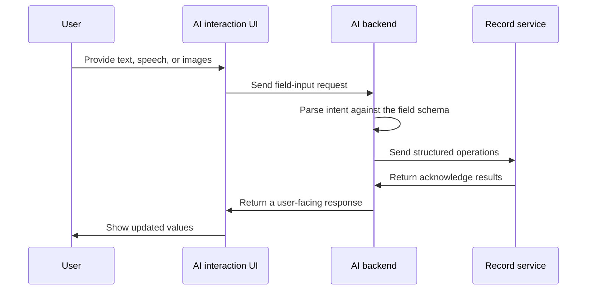

# Automated Field Input

This capability maps to `POST /api/endpoints/chat/field_input`. The goal is to turn natural-language, speech, or image-derived information into structured updates for a protocol's fields.

## A simple example

Suppose a protocol defines these fields:

```txt
Experimenter name: {{var|experimenter_name}}
Lab temperature: {{var|lab_temperature}}
Lab humidity: {{var|lab_humidity}}
```

With a corresponding model:

```py
from pydantic import BaseModel


class VarModel(BaseModel):
    experimenter_name: str
    lab_temperature: float
    lab_humidity: float
```

That schema gives the backend enough structure to translate user input into explicit field operations.


## Flow



## Operation payload

The central backend artifact is a list of operations:

```json
{
  "operations": [
    {
      "operation": "update",
      "field_id": "experimenter_name",
      "field_value": "Zhang San"
    },
    {
      "operation": "update",
      "field_id": "lab_temperature",
      "field_value": 25.0
    }
  ]
}
```

Here:

- `field_id` matches a field in the protocol schema
- `field_value` is what the model extracted
- `operation` describes the action, usually `update`

## Acknowledge payload

After execution, the record side can return per-operation results:

```json
{
  "operation_results": [
    {
      "success": true,
      "field_id": "experimenter_name",
      "field_value_updated": "Zhang San",
      "message": "The value of experimenter_name has been set."
    }
  ]
}
```

If validation fails, `success` should be `false` and `message` should explain why.

## Relationship to chat

From the conversation model's perspective, field input is still a standard tool call:

- the user describes what should be filled
- the assistant issues a `field_input` tool call
- the tool returns structured results
- the assistant turns that into a user-facing confirmation

That lets the UI reuse the same chat rendering model while the backend preserves structured execution results.
