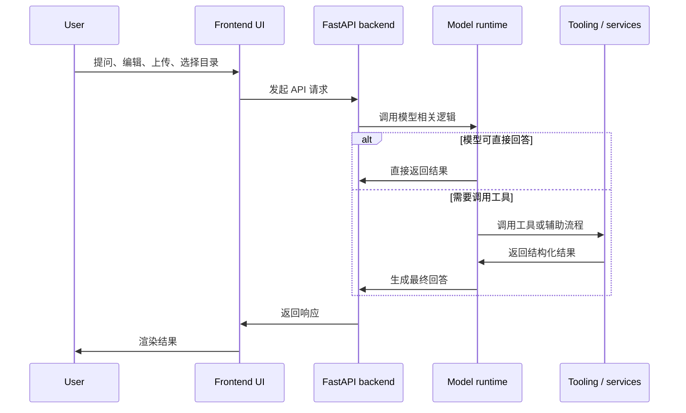

# 系统架构

## 运行时分层

Masterbrain 将 UI、后端协调层和模型执行层明确分开：

后端不是一个简单代理层，它负责：

- 暴露稳定的 API 契约
- 处理环境差异和本地桌面模式
- 管理模型密钥与错误映射
- 管理工作区目录与文件系统边界
- 在存在构建产物时托管前端静态资源

## FastAPI 主入口

`apps/api/src/masterbrain/fastapi/main.py` 是整个服务的装配点。它会：

- 把所有公共路由统一挂载到 `/api/endpoints`
- 将模型相关异常转换为稳定的 HTTP 错误
- 在检测到 `apps/web/dist` 时直接托管前端
- 支持 `masterbrain-desktop` 的一体化本地应用模式

这让同一套后端既能支持源码开发，也能支持本地桌面式打包分发。

## 前端与工作区模型

前端位于 `apps/web`，开发模式下由 Vite 提供；集成模式下则由 FastAPI 托管生产构建产物。

当前架构中最关键的设计点之一是：工作区是磁盘上的真实目录，而不是抽象的内存项目。

因此：

- `workspace` 路由负责确定性的文件和目录操作
- `code_edit` 路由负责基于当前工作区快照的 AI 改代码流程
- ZIP 导入导出都由后端针对当前目录执行

这样既保留了模型侧的清晰边界，也让本地文件系统访问集中在后端一侧。

## 工具调用与主对话解耦

对于需要工具调用的对话，Masterbrain 仍然沿用 OpenAI 风格的消息结构：

- assistant 发出 `tool_calls`
- tool 通过 `tool_call_id` 返回结果
- assistant 基于 tool 结果继续回答

这种设计的好处是：

- 主对话历史保持简洁
- 工具内部实现可以独立演进
- 前端可以清楚展示“调用了什么工具、返回了什么结果”
- 排查问题时更容易定位是模型问题还是工具问题

更细的数据结构见[对话数据结构](/zh/chat/data-structure)。
