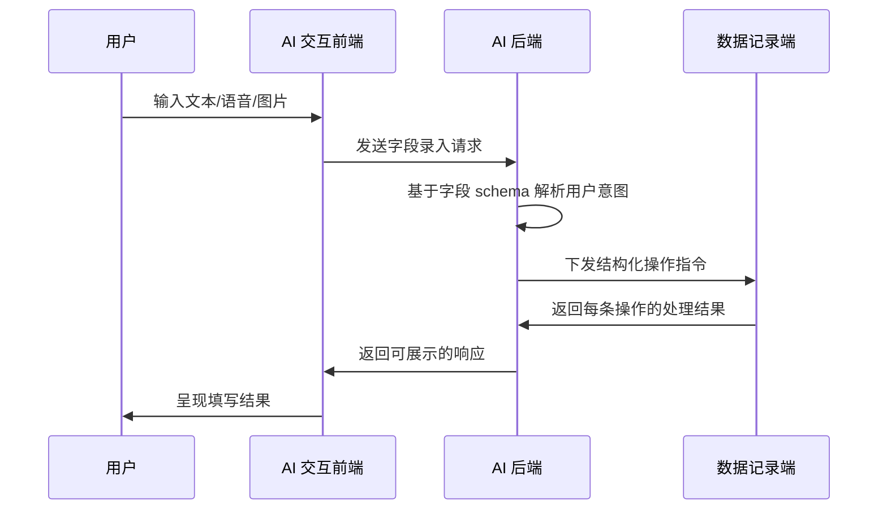

# AI 自动化字段录入

这个能力对应当前后端中的 `POST /api/endpoints/chat/field_input`。它的目标是把自然语言、语音或图片中包含的结构化信息，映射到 protocol 的字段上。

## 一个简单例子

假设 protocol 中定义了如下字段：

```txt
实验者名字：{{var|experimenter_name}}
实验室温度：{{var|lab_temperature}}
实验室湿度：{{var|lab_humidity}}
```

对应的模型大致是：

```py
from pydantic import BaseModel


class VarModel(BaseModel):
    experimenter_name: str
    lab_temperature: float
    lab_humidity: float
```

那么后端就可以拿到字段的 JSON Schema，并据此把用户输入转换为结构化操作。


## 技术流程



## 操作指令

后端生成的核心结果通常是一组操作，例如：

```json
{
  "operations": [
    {
      "operation": "update",
      "field_id": "experimenter_name",
      "field_value": "张三"
    },
    {
      "operation": "update",
      "field_id": "lab_temperature",
      "field_value": 25.0
    }
  ]
}
```

其中：

- `field_id` 对应字段 schema 中的键
- `field_value` 是模型从用户输入里抽取出的值
- `operation` 表示动作类型，常见为 `update`

## 返回结果

记录端处理完操作之后，通常会返回逐条 acknowledge：

```json
{
  "operation_results": [
    {
      "success": true,
      "field_id": "experimenter_name",
      "field_value_updated": "张三",
      "message": "The value of experimenter_name has been set."
    }
  ]
}
```

如果值类型不符合 schema，或字段不存在，`success` 就应为 `false`，并由 `message` 给出失败原因。

## 与对话结构的关系

从对话建模角度看，字段录入仍然可以被视为一次标准工具调用：

- 用户描述要填写的信息
- assistant 发起 `field_input` 工具调用
- tool 返回结构化操作结果
- assistant 再把结果转换成对用户友好的确认信息

这使得字段录入既能复用统一的消息结构，也能保留结构化执行结果。
